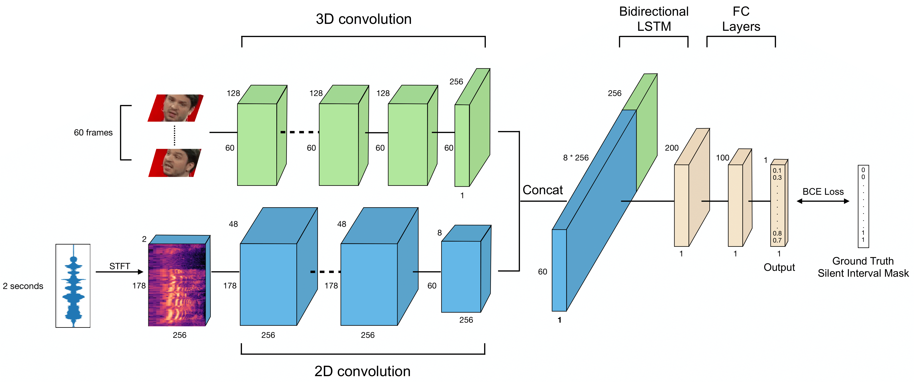
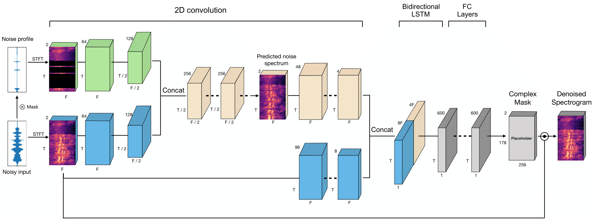

# Audiovisual Denoising via Silent Interval Detection

## Introduction

This is the repository of the Audiovisual Denoising project. At a high level, this work is an audio-visual model for the task of audio denoising on the noisy audio track of a video by looking at its corresponding visual features (video frames). The key idea is to detect out silent intervals, that is the audio intervals that do not contain useful contents but noise, spreading across the entire audio track incorporating both visual and auditory signals. An overview of the Silent Interval Detection Model is shown here:



With this discrete distribution of silent intervals, a full noise distribution of the entire audio track can then be generated and therefore the audio denoising task can be simply achieved. An overview of the Audio Denoising Model is shown here:



We demonstrate the effectiveness of the proposed audiovisual based audio denoising method on speech videos by comparing the denoising results of real-world noisy videos with different types of noises (assuming additive noises) at different Signal-To-Noise Ratios (SNR). Note that the proposed method is not limited to only speech videos (thus for only speech videos, the proposed method can be considered *noise, speaker, and language independent*). As long as silent intervals can be clearly defined on both audio and video domains, the proposed method will theoretically work well.

## Dependencies

* Python 3
* PyTorch 1.3.0

You can install the requirements either to your virtualenv or the system via pip with:

```bash
pip install -r requirements.txt
```

## Dataset

### Audiovisual dataset structure

Please organize the dataset directory as follows:

```
dataset/
├── video1.mp4
├── video2.mp4
├── video3.mp4
...
```

In addition, please provide a csv file specifying each video file's information including the `file_name` (without extension), `start_time` (in seconds), `end_time` (in seconds; -1 if at the end of the video), `face_x` (in range [0, 1]), and `face_y` (in range [0, 1])`. For example:

```
video1, 0, -1, 0.5, 0.5
video2, 0, -1, 0.5, 0.5
video3, 0, -1, 0.5, 0.5
...
```

### Audio-only dataset structure

Similarly, please organize the dataset directory as follows:

```
dataset/
├── audio1.wav
├── audio2.wav
├── audio3.wav
...
```

Please also provide a csv file including each audio file's `file_name` (without extension). For example:

```
audio1
audio2
audio3
...
```

Examples are provided in the `data` directory.

## Data Preprocessing

For audiovisual dataset, run the script:

```bash
python preprocessing/preprocessor_audiovisual.py
```

For audio-only dataset, run the script:

```bash
python preprocessing/preprocessor_audioonly.py
```

**Note:** Please specify dataset's directory, csv file, and output path inside `prreprocessor_*.py`.

## Inference

### Step 1

1. Go to `model_1_silent_interval_detection` directory
2. Choose either the `audiovisual_model` or `audioonly_model`
3. Run
    ```bash
    CUDA_DEVICE_ORDER=PCI_BUS_ID CUDA_VISIBLE_DEVICES=0,1 python3 predict.py --save_results false --unknown_clean_signal true
    ```
4. Run
    ```bash
    python3 create_data_from_pred.py --unknown_clean_signal true
    ```
5. Outputs can be found in the `model_output` directory.

### Step 2

1. Go to `model_2_audio_denoising` directory
2. Choose `pure_noise_audio_denoising_model`
3. Run
    ```bash
    CUDA_DEVICE_ORDER=PCI_BUS_ID CUDA_VISIBLE_DEVICES=0 python3 predict.py --unknown_clean_signal true
    ```
4. Outputs can be found in the `model_output` directory. The denoised result is called `denoised_output.wav`.

## Contact

E-mail: rxu@cs.columbia.edu
