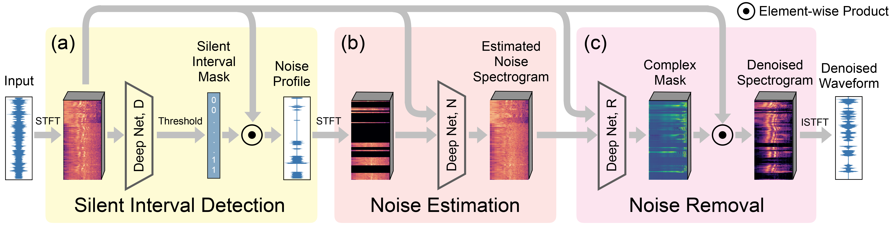

# Listening to Sounds of Silence for Speech Denoising

## Introduction

This is the repository of the "Listening to Sounds of Silence for Speech Denoising" project. (Project URL: [here](http://www.cs.columbia.edu/cg/listen_to_the_silence/)) Our approach is based on a key observation about human speech: there is often a short pause between each sentence or word. In a recorded speech signal, those pauses introduce a series of time periods during which only noise is present. We leverage these incidental silent intervals to learn a model for automatic speech denoising given only mono-channel audio. Detected silent intervals over time expose not just pure noise but its time varying features, allowing the model to learn noise dynamics and suppress it from the speech signal. An overview of our audio denoise network is shown here:



Our model has three components: (a) one that detects silent intervals over time, and outputs a noise profile observed from detected silent intervals; (b) another that estimates the full noise profile, and (c) yet another that cleans up the input signal.

## Dependencies

* Python 3
* PyTorch 1.3.0

You can install the requirements either to your virtual environment or the system via pip with:

```bash
pip install -r requirements.txt
```

## Data

### Training and Testing

Our model is trained on publicly available audio datasets. We obtain clean speech signals using [AVSPEECH](https://looking-to-listen.github.io/avspeech/), from which we randomly choose 2448 videos (4:5 hours of total length) and extract their speech audio channels. Among them, we use 2214 videos for training and 234 videos for testing, so the training and testing speeches are fully separate.

We use two datasets, [DEMAND](https://hal.inria.fr/hal-00796707) and Google’s [AudioSet](https://research.google.com/audioset/dataset/index.html), as background noise. Both consist of environmental noise, transportation noise, music, and many other types of noises. `DEMAND` has been widely used in previous denoising works. Yet `AudioSet` is much larger and more diverse than `DEMAND`, thus more challenging when used as noise.

Due to the linearity of acoustic wave propagation, we can superimpose clean speech signals with noise to synthesize noisy input signals. When synthesizing a noisy input signal, we randomly choose a signal-to-noise ratio (SNR) from seven discrete values: -10dB, -7dB, -3dB, 0dB, 3dB, 7dB, and 10dB; and by mixing the foreground speech with properly scaled noise, we produce a noisy signal with the chosen SNR. For example, a -10dB SNR means that the power of noise is ten times the speech. The SNR range in our evaluations (i.e., [-10dB, 10dB]) is significantly larger than those tested in previous works.

### Dataset Structure (For inference)

Please organize the dataset directory as follows:

```
dataset/
├── audio1.wav
├── audio2.wav
├── audio3.wav
...
```

Please also provide a csv file including each audio file's `file_name` (without extension). For example:

```
audio1
audio2
audio3
...
```

An example is provided in the `data/sounds_of_silence_audioonly_original` directory.

## Data Preprocessing

To process the dataset, run the script:

```bash
python preprocessing/preprocessor_audioonly.py
```

**Note:** Please specify dataset's directory, csv file, and output path inside `preprocessor_audioonly.py`. After running the script, the dataset directory looks like the `data/sounds_of_silence_audioonly` directory, with a `JSON` file (`sounds_of_silence.json` in this example) linking to the directory.

## Inference

### Step 1

1. Go to `model_1_silent_interval_detection` directory
2. Choose the `audioonly_model`
3. Run
    ```bash
    CUDA_DEVICE_ORDER=PCI_BUS_ID CUDA_VISIBLE_DEVICES=0,1 python3 predict.py --ckpt 87 --save_results false --unknown_clean_signal true
    ```
4. Run
    ```bash
    python3 create_data_from_pred.py --unknown_clean_signal true
    ```
5. Outputs can be found in the `model_output` directory.

### Step 2

1. Go to `model_2_audio_denoising` directory
2. Choose `audio_denoising_model`
3. Run
    ```bash
    CUDA_DEVICE_ORDER=PCI_BUS_ID CUDA_VISIBLE_DEVICES=0 python3 predict.py --ckpt 24 --unknown_clean_signal true
    ```
4. Outputs can be found in the `model_output` directory. The denoised result is called `denoised_output.wav`.

### Command Parameters Explanation:

1. `--ckpt [number]`: Refers to the pretrained model located in each models output directory (`model_output/{model_name}/model/ckpt_epoch{number}.pth`).
2. `--save_results [true|false]`: If `true`, intermediate audio results and waveform figures will be saved. Recommend to leave it off to speed up the inference process.
3. `--unknown_clean_signal [true|false]`: If running inference on external data (data without known clean signals), please set it to `true`.

## Contact

E-mail: rxu@cs.columbia.edu

<br />

---

<br />

© 2020 The Trustees of Columbia University in the City of New York. This work may be reproduced and distributed for academic non-commercial purposes only without further authorization, but rightsholder otherwise reserves all rights.